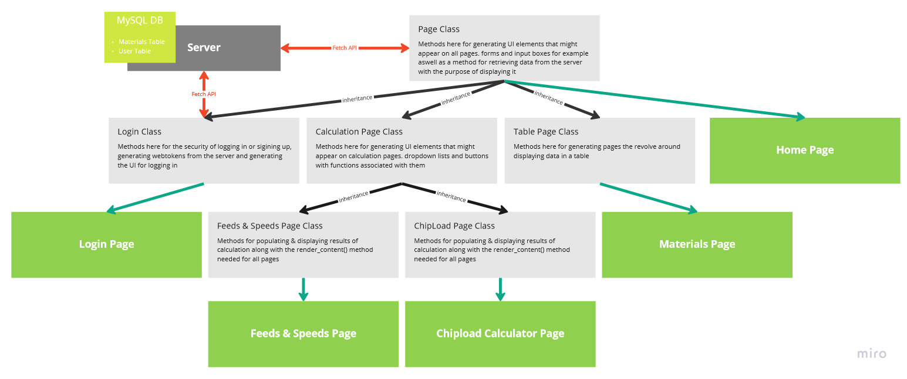

**Introduction**

This is my first web project. The main purpose of this project was a learning one. I wanted a project that went through the whole process of making a web app and would teach me a broad range of topics about the web, from javascript to hosting and DNS. 

The app allows users to store chip load data on materials they wish to cut with a CNC router. It can then roughly calculate the feeds and speeds for a good cut. It can also convert feeds and speeds settings used on an unfamiliar material into chip load data and then store that data in the database. Users can also manually add chip load data to the database.

There are 2 tables on the database, Materials and Users. There is a foreign key in the Materials table noting which User has stored it. All materials from all users are stored in the Materials table and when a client requests data, the server filters the results based on the User requesting it.

**How The App is Built**

**FrontEnd**

* The front end is made entirely with vanilla javascript, I wanted to learn the basics of javascript before diving into a major framework.
* The concept of a single page app interests me so I decided the project should be built as one.
* The frontend is built around the OOP paradigm (which I regret in some ways, see further down for details)

**BackEnd**

* The site is hosted on a digital ocean virtual machine (droplet) running linux.
* Nginx with a reverse proxy handles the requests 
* Nodejs and express run the server
* Mysql is the database system used
* Bcrypt and Jsonwebtoken are used to handle user passwords and logged in cookies.

**Project Map**

**Things I Enjoyed**

* As I was not using any frameworks or libraries for the front end, it was very satisfying to build functions for DOM manipulation and call them multiple times. Nearly all the UI elements are produced using a function call.
* While on this topic, learning about event delegation was a particular highlight. I Have 1 eventhandler & listener for the nav bar and one for every other button. For buttons not on the nav bar, using a json object, the buttons html id and the function for it are stored in a key:value pair. The event handler then tries to match the event id to the button id and if there's a match, the function is called.  
* Learning how to hash and store passwords safely as well as using json web tokens was rewarding as I have always wondered what the mechanisms for logging onto a website were.
* Using a relational database to store user specific data for the first time has been eye opening experience and has opened the door to using it in more complex projects.   
* Despite building the site around classes the server is roughly function based. Learning about call backs was a satisfying concept to learn…once it clicked. 

**Challenges I Encountered**

* **CORS** - I had issues believing CORS errors were due to my nginx config but it had simply been a typo defining the origin. The hours I spent researching and debugging this taught me a few things:
    * To go right to the ground floor while looking for a bug and not to skip corners.
    * Why does CORS exist (to stop sites using your login cookies for other sites!)
    * How to use the network tab on developer tools
    * How fetching works including but not limited to headers, bodies, & http response codes 
* **HTTPS** - I spent quite a bit of time trying to host my website and while typing the IP address to the server worked well enough I had issues using a domain name. This turned out to be a domain validation issue which was solved by using the lets encrypt automatic nginx config. However trying to solve this through different avenues taught me:
    * DNS - I had researched DNS while purchasing a domain but this error led me to a lot more research on how it actually works.
    * Letsencrypt - after realising it was a domain validation issue, I tried creating my own key, which let users know that the site was unsafe. Looking back it was a silly idea. It's then I started to research letsencrypt.
* **Trying to make my server without express** - Originally, in the spirit of learning from the ground up, I tried to make my node server without express and just use the http module. As this was very early on in the project and my learning, it felt hard to continue my learning as it felt like hitting a dead end. I conceded and used express, it taught me that:
    * Having fun and feeling productive and perseverance are all important to my learning. 

**What I Would Have Done Differently**

* **Functional programming** - It was only when I was in the middle of the project that I had learnt that classes were a relatively new feature in javascript and that classes are converted into prototypes. In the spirit of learning I feel I should have based the project around functional programming
* **Splitting the project into features _and _pages** - Looking at the project map, I had split the project up into pages which was mostly great but when I wanted to add a new feature I had to move methods up the inheritance chain. I feel it would have been easier to split the project into feature class/es(tables, calculators etc) and then group them together into page classes.
* **Start with the backend first** - In my excitement to jump in and create something, I started with the front end which I quickly came to regret as when I started making changes in the back end, I had to make drastic changes to the front end.
* **Non relational database** - using mysql for this project feels like overkill. It was great to learn as I was interested in it but I feel like the data would be much more easily (and cheaply) stored in a non-relational database.

**Todo**

I am itching to start my next project but if the site is getting used (by my colleagues mainly) then I will devote some time to the following things:

* **Slow server response** - This could be due to the digital ocean droplet being quite underpowered for mysql.
* **CSS overhaul and general graphic design** - It looks terrible, graphic design was not a priority for this project but after seeing how powerful CSS can be on codepen, it's something I would like to address or prioritise on my next project.
* **Homepage flash on login** - I sillily wrote the nav bar in html when i first started learning rather than creating it in js so i have to hide it on the login page, i think this is what is causing it to flash up.
* **Retrieve password mechanism** - Currently there isn't a way of doing this other than contacting me directly to modify the user table manually.
* **Edit Database entries** - All a user can do on the site is add and delete records in the database, it would be worthwhile allowing them to edit past entries.
* **Display estimated entries** - due to the maths of calculating feeds and speeds, some of the entries are estimated, it would be good to show this in the materials table, maybe with colour, then allow the user to calculate  the chip load with greater accuracy.
